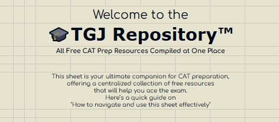

# 🎓 TheGradsJourney™

  
   
  <strong>"Learn, Share & Succeed Together"</strong>

---

## 📑 Table of Contents
- [Access the Google Sheet](#-access-the-google-sheet)
- [Support This Project](#-support-this-project)
- [Features of the Repository](#-features-of-the-repository)
- [How to Use This Sheet](#-how-to-use-this-sheet)
- [What You’ll Find in Each Section](#-what-youll-find-in-each-section)
- [FAQs](#-frequently-asked-questions-faqs)
- [Disclaimer](#-disclaimer)
- [Contact Us](#-contact-us)

---

## 📊 Access the Google Sheet

All CAT preparation resources are organized in this Google Sheet. Explore the tabs at the bottom to navigate through different sections (QA, LRDI, VARC, Study Plan):  
[🔗 Open Google Sheet](https://docs.google.com/spreadsheets/d/1KNfLs4Iax4q87zg2SqL3VHyBQCqQWg3v9YMqoB8vKzo/edit?gid=480061171#gid=480061171)

---

## 🌟 Support This Project

If you find this repository helpful, please consider **starring** it ⭐️ to show your support! Starring helps us reach more CAT aspirants and motivates us to keep improving.

Also, feel free to **contribute** by submitting resources, reporting issues, or sharing feedback. Together, we can make this the best CAT preparation resource repository!

---

## 🚀 Features of the Repository

- ✅ **Complete Coverage**: Resources cover the full CAT syllabus, including foundational lectures, practice questions, and solved examples.
- 🔄 **Regular Updates**: The sheet is updated daily with new content and corrections.
- 🆓 **Free of Cost**: 100% free and accessible to everyone.

---

## ⁉ How to Use This Sheet

1. **Explore the Tabs**: Navigate through the different sections (QA, LRDI, VARC, Study Plan) using the tabs at the bottom of the sheet.
2. **Submit Resources**: Click on the "Submit Resources" button to contribute new content.
3. **Report Issues**: Use the "Report a Problem" button to notify us of errors or broken links.
4. **Share Feedback**: Click on "Ideas/Feedback" to share your thoughts.

---

## 🔍 What You’ll Find in Each Section

- **💪🏼 Foundational Lectures**:  
  Links to free video lectures by trusted educators like Raviprakash, Gejo Speaks, Ashish Kumar, Raman Tiwari, Mathological, Udit Saini, and many more.

- **🙌🏼 Solved Questions**:  
  CAT PYQs and similar-level solved problems in video format.

- **✍🏼 Practice Questions**:  
  Curated problems from various free sources to help you master each topic.

---

## ❓ Frequently Asked Questions (FAQs)

| Question                          | Answer                                                                 |
|-----------------------------------|-----------------------------------------------------------------------|
| **Who can use this sheet?**       | Anyone preparing for CAT or similar MBA entrance exams.              |
| **How often is the sheet updated?** | The repository is updated daily with relevant content.               |
| **What if I find an error or broken link?** | Report it by clicking on the "Report a Problem" button.              |
| **Can I contribute to the repository?** | Absolutely! Click on "Submit Resources" to contribute.               |

---

## 🙏 Disclaimer

This repository is an open-source project built by CAT aspirants for CAT aspirants. All resources included in this sheet are publicly available and credited to their respective creators. This is a not-for-profit initiative aimed at helping CAT aspirants.

---

## 📞 Contact Us

For any queries, suggestions, or technical issues, connect with us via:
- 💙 [Telegram](https://telegram.me/TheGradsJourney)
- 💜 [Instagram](https://www.instagram.com/thegradsjourney/)
- 🧡 [Reddit](https://www.reddit.com/user/ProjectDistinct27/)
- 📩 [Share Feedback](https://forms.gle/dTzPaNxCAczt7Ar19)

---

© All Rights Reserved with 🎓 TheGradsJourney™
